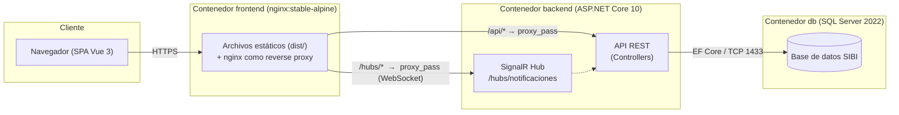
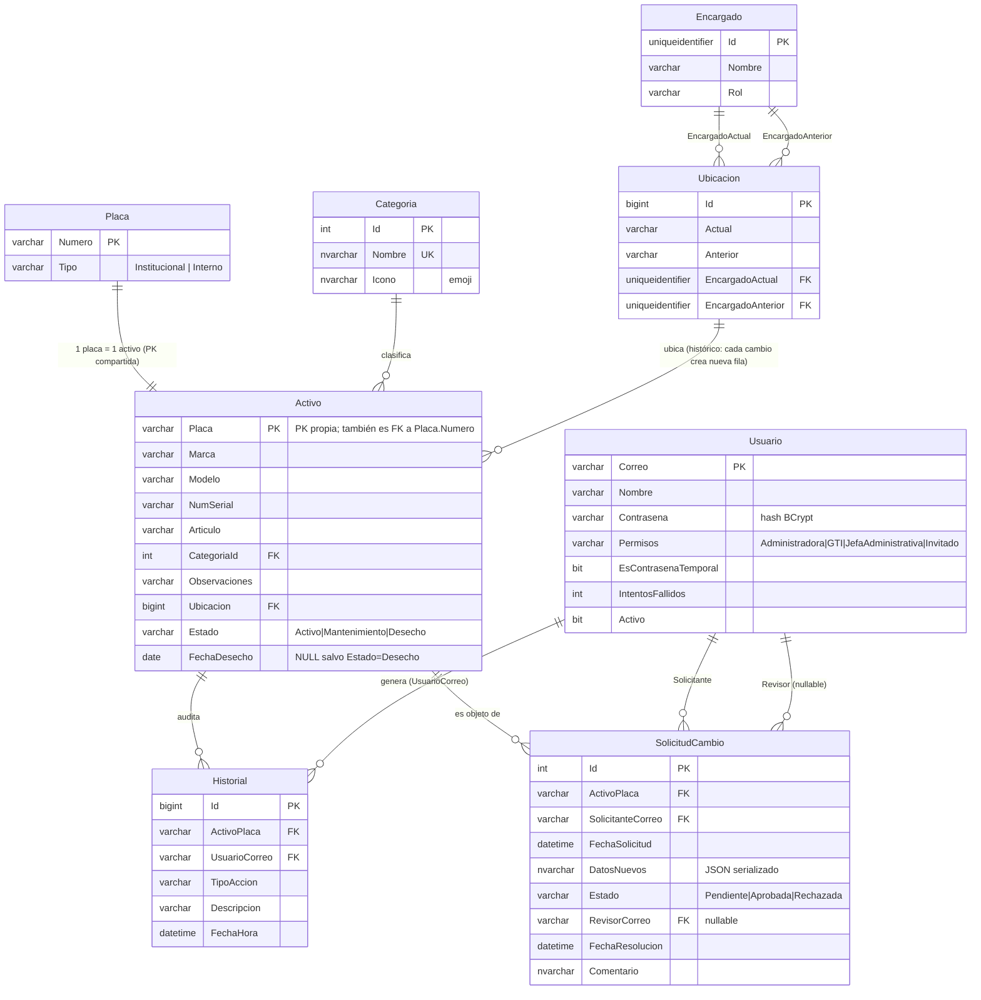
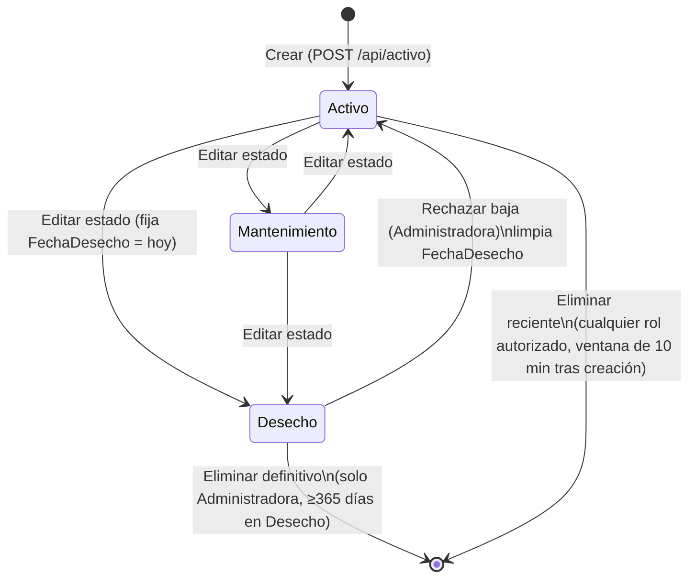
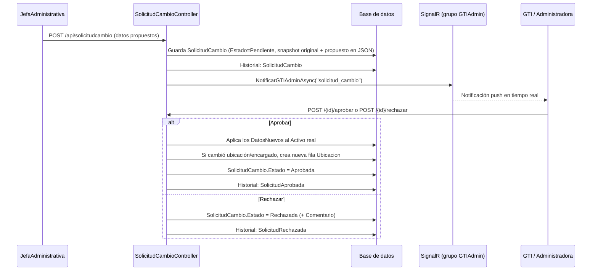

# Manual Técnico — SIBI (Sistema de Inventario de Bienes Institucionales)

**Escuela de Ingeniería Civil (EIC) — Universidad de Costa Rica**

Este documento existe para que cualquier desarrollador que no conozca el proyecto pueda leerlo, entender por qué está construido como está, y retomar el trabajo sin tener que hacer arqueología de código. Cubre arquitectura, backend, frontend, base de datos, seguridad, despliegue y flujos de negocio.

> Convención del proyecto: nombres de clases, propiedades, rutas y mensajes están en español, porque el dominio (bienes institucionales de una universidad costarricense) y sus usuarios son hispanohablantes. Este manual mantiene esa convención al referirse a entidades del código (`Activo`, `Encargado`, etc.) pero está escrito en español para que sea consistente con el resto del repositorio.

---

## Tabla de contenido

1. [Qué es SIBI](#1-qué-es-sibi)
2. [Arquitectura general](#2-arquitectura-general)
3. [Stack tecnológico](#3-stack-tecnológico)
4. [Estructura de carpetas](#4-estructura-de-carpetas)
5. [Modelo de datos y base de datos](#5-modelo-de-datos-y-base-de-datos)
6. [Backend (.NET)](#6-backend-net)
7. [Frontend (Vue 3)](#7-frontend-vue-3)
8. [Autenticación, autorización y seguridad](#8-autenticación-autorización-y-seguridad)
9. [Notificaciones en tiempo real (SignalR)](#9-notificaciones-en-tiempo-real-signalr)
10. [Despliegue con Docker Compose](#10-despliegue-con-docker-compose)
11. [Despliegue alternativo (frontend/backend separados, ej. Vercel)](#11-despliegue-alternativo-frontendbackend-separados-ej-vercel)
12. [Cómo levantar el proyecto en desarrollo local (sin Docker)](#12-cómo-levantar-el-proyecto-en-desarrollo-local-sin-docker)
13. [Flujos de negocio clave](#13-flujos-de-negocio-clave)
14. [Matriz de permisos por rol](#14-matriz-de-permisos-por-rol)
15. [Decisiones de diseño y por qué existen](#15-decisiones-de-diseño-y-por-qué-existen)
16. [Deuda técnica y limitaciones conocidas](#16-deuda-técnica-y-limitaciones-conocidas)
17. [Preguntas frecuentes y errores comunes](#17-preguntas-frecuentes-y-errores-comunes-troubleshooting)
18. [Dónde tocar el código para tareas comunes](#18-dónde-tocar-el-código-para-tareas-comunes)

---

## 1. Qué es SIBI

SIBI es el sistema interno de la EIC-UCR para llevar el inventario de bienes institucionales (computadoras, mobiliario, equipo de laboratorio, etc.), identificados por **placa**. Para cada bien se registra marca, modelo, número de serie, categoría, ubicación física, encargado responsable, estado (Activo / Mantenimiento / Desecho) y un historial completo de cambios (auditoría).

El sistema tiene cuatro roles con distinto nivel de permiso (ver [sección 14](#14-matriz-de-permisos-por-rol)):

- **Administradora**: control total (usuarios, categorías, eliminación definitiva de activos, aprobación de solicitudes).
- **GTI** (Gestión de Tecnologías de Información): gestión operativa del inventario, encargados, aprobación/rechazo de solicitudes de cambio.
- **JefaAdministrativa**: no edita activos directamente; **propone** cambios mediante "solicitudes de cambio" que GTI/Administradora deben aprobar.
- **Invitado**: solo lectura. Puede ver el inventario, una vista rápida de cada activo (modal, al hacer clic en la tabla), categorías y la lista de Desecho (sin botones de acción), pero no la página de detalle completo de un activo ni el historial/auditoría (ver `requiresNoInvitado` en el router y el `v-if="!auth.esInvitado"` sobre el botón "ver detalle completo" en `ActivoModal.vue`).

Módulos funcionales (cada uno = una vista Vue + un controller en el backend):

| Módulo | Vista frontend | Controller backend |
|---|---|---|
| Login / recuperación / cambio de contraseña | `LoginView`, `RecuperarContrasenaView`, `CambiarContrasenaView` | `AuthController` |
| Dashboard con estadísticas | `DashboardView` | `ActivoController` (`/stats`, `/recientes`) |
| Inventario (listar/crear/editar/buscar activos) | `InventarioView`, `ActivoDetalleView`, `ActivoModal`, `ImportarActivosModal` | `ActivoController` |
| Categorías de activos | `CategoriasView` | `CategoriaController` |
| Encargados (personas responsables de bienes) | `EncargadosView` | `EncargadoController` |
| Desecho (baja de activos) | `DesechoView` | `DesechoController` |
| Historial / auditoría | `HistorialView` | `HistorialController` |
| Solicitudes de cambio (flujo de aprobación) | `SolicitudesView`, `MisSolicitudesView` | `SolicitudCambioController` |
| Usuarios del sistema | `UsuariosView` | `UsuarioController` |
| Notificaciones push en tiempo real | `stores/notificaciones.js` | `Hubs/NotificacionHub.cs` |

---

## 2. Arquitectura general

Aplicación de 3 capas clásica, cada una en su propio contenedor Docker:



Puntos clave de esta arquitectura:

- El **frontend nunca habla directo con el backend en producción**: nginx dentro del contenedor `frontend` actúa de reverse proxy para `/api/` y `/hubs/`, hacia el contenedor `backend` por la red interna de Docker (`sibi-net`). Esto evita problemas de CORS en producción y expone un solo puerto público.
- En **desarrollo**, el proxy lo hace `vue-cli-service` (ver `frontend/vue.config.js`, `devServer.proxy`) hacia `http://localhost:5025`.
- El backend expone Swagger solo en `Development` (`Program.cs`, `if (app.Environment.IsDevelopment())`).
- Hay un **servidor nginx del host** (fuera de Docker) descrito en `nginx/eic.sibi.ucr.ac.cr.conf`, que es el que finalmente recibe tráfico del dominio `eic.sibi.ucr.ac.cr` y lo reenvía al contenedor `frontend` (publicado en el puerto `8081` del host). Es decir, hay **dos niveles de nginx**: uno en el host (dominio, TLS terminado ahí presumiblemente por un proxy superior) y uno dentro del contenedor `frontend` (SPA + proxy interno hacia backend).

---

## 3. Stack tecnológico

### Backend
- **.NET 10** / ASP.NET Core Web API (`backend/backend.csproj`, `TargetFramework=net10.0`)
- **Entity Framework Core 10** con proveedor **SQL Server** (`Microsoft.EntityFrameworkCore.SqlServer`)
- **JWT Bearer** para autenticación (`Microsoft.AspNetCore.Authentication.JwtBearer`)
- **BCrypt.Net-Next** para hash de contraseñas
- **SignalR** para notificaciones push en tiempo real
- **Swashbuckle** (Swagger/OpenAPI) solo en desarrollo

### Frontend
- **Vue 3** (Options/Composition API mixtas) con **Vue CLI 5** (no Vite)
- **Pinia** para estado global (auth, notificaciones)
- **Vue Router 4** con guardas de navegación basadas en roles
- **Axios** para HTTP, con interceptores de token y logout automático en 401
- **@microsoft/signalr** cliente para el hub de notificaciones
- **Tailwind CSS 3** para estilos (utility-first, sin librería de componentes)
- **xlsx** (SheetJS) para importar/exportar Excel
- **jsPDF + jspdf-autotable** para exportar reportes en PDF

### Base de datos
- **SQL Server 2022** (imagen oficial `mcr.microsoft.com/mssql/server:2022-latest`, edición Express vía `MSSQL_PID`)

### Infraestructura
- **Docker Compose** orquesta 3 servicios: `db`, `backend`, `frontend`
- **nginx** como servidor web del frontend y como reverse proxy del host

---

## 4. Estructura de carpetas

```
SIBI/
├── backend/                     # API .NET
│   ├── Controllers/              # 7 controllers REST (uno por recurso)
│   ├── DTOs/                     # Records de entrada/salida (nunca se exponen los Models directo)
│   ├── Data/SibiDbContext.cs     # Configuración de EF Core (Fluent API, no hay migraciones EF)
│   ├── Hubs/NotificacionHub.cs   # Hub SignalR
│   ├── Models/                   # Entidades EF (mapeadas 1:1 a tablas SQL existentes)
│   ├── Services/                 # AuthService, HistorialService, NotificacionService
│   ├── Program.cs                # Composition root: DI, JWT, CORS, SignalR, pipeline HTTP
│   ├── appsettings.json          # Config base (producción)
│   └── appsettings.Development.json
├── database/
│   ├── SIBI.sql                  # DDL completo (CREATE DATABASE + tablas + constraints)
│   ├── seed.sql                  # Inserta usuario administrador inicial (idempotente)
│   ├── migrate_categoria_nvarchar.sql  # Migración puntual (VARCHAR→NVARCHAR en Categoria)
│   ├── init.sh                   # Entrypoint del contenedor db: aplica SQL solo la 1ª vez
│   └── Dockerfile
├── frontend/                     # SPA Vue 3
│   ├── src/
│   │   ├── components/           # Componentes compartidos (modales, layout, selects)
│   │   ├── composables/          # useDialog.js (diálogo de confirmación global)
│   │   ├── router/index.js       # Rutas + guardas de navegación
│   │   ├── services/             # 1 archivo por recurso, wrapper delgado sobre axios
│   │   ├── stores/                # Pinia: auth.js, notificaciones.js
│   │   ├── utils/emojiGrupos.js  # Paleta de emojis para íconos de categoría
│   │   └── views/                # 1 vista por ruta/módulo
│   ├── nginx.conf                # Config de nginx DENTRO del contenedor frontend
│   └── Dockerfile
├── nginx/eic.sibi.ucr.ac.cr.conf # Config de referencia para el nginx del SERVIDOR (host), no se usa en Docker
├── tools/HashGenerator/           # Consola .NET para generar hashes BCrypt manualmente (setup inicial)
├── docker-compose.yml             # Orquesta db + backend + frontend
└── .env.example                   # Plantilla de variables de entorno para docker compose
```

---

## 5. Modelo de datos y base de datos

### 5.1 Diagrama entidad-relación



### 5.2 Particularidades importantes del esquema

1. **`Activo.Placa` es simultáneamente la PK de `Activo` y una FK a `Placa.Numero`.** Es decir, cada bien tiene exactamente una fila en `Placa` (que solo guarda el tipo: Institucional/Interno) y una fila en `Activo` (todo lo demás). Esto permite **cambiar la placa de un activo** sin perder historial: `ActivoController.CambiarPlaca` crea una fila `Placa` + `Activo` nuevas, re-apunta `Historial` y `SolicitudCambio` a la nueva placa, y borra las filas viejas — todo dentro de una transacción (ver `backend/Controllers/ActivoController.cs`, método `CambiarPlaca`).

2. **`Ubicacion` es un histórico append-only, no se edita in-place.** Cada vez que cambia la ubicación física o el encargado de un activo, se inserta una **fila nueva** en `Ubicacion` (con `Anterior` apuntando a los valores previos) y el `Activo.Ubicacion` se re-apunta a esa fila nueva. La fila vieja **no se borra** (queda huérfana de `Activo` pero conserva su historia). Esto es lo que permite mostrar "ubicación anterior / encargado anterior" en el detalle de un activo sin necesidad de una tabla de auditoría aparte para movimientos.

3. **`Historial` es la tabla de auditoría central.** Toda mutación relevante de un `Activo` pasa por `HistorialService.RegistrarAsync(...)`, que inserta una fila con un `TipoAccion` restringido por CHECK constraint a un enum fijo: `Creacion, CambioUbicacion, CambioEncargado, CambioEstado, CambioPlaca, Eliminacion, Aprobacion, Rechazo, SolicitudCambio, SolicitudAprobada, SolicitudRechazada`. **No hay triggers de SQL**: la auditoría es 100% responsabilidad del backend (ver comentario en `SIBI.sql`: "gestionado desde el backend, no con triggers"). Si se agrega un endpoint nuevo que muta un `Activo`, hay que acordarse de llamar `HistorialService` explícitamente y, si el `TipoAccion` es nuevo, **agregar el valor al CHECK constraint** (`CHK_Historial_TipoAccion`) en la base de datos.

4. **`SolicitudCambio.DatosNuevos` es JSON libre**, deserializado como `SolicitudDatosDto` (ver `backend/DTOs/SolicitudCambioDto.cs`). Guarda tanto los valores propuestos como un **snapshot de los valores originales** (`MarcaOriginal`, `ModeloOriginal`, etc.) tomado en el momento de crear la solicitud, para que la UI pueda mostrar un diff "antes/después" aunque el activo haya cambiado entre tanto.

5. **Reglas de negocio impuestas por CHECK constraints** (documentadas en `database/SIBI.sql`):
   - `CHK_Usuario_Correo`: solo se permiten correos que terminen en `@ucr.ac.cr`.
   - `CHK_Usuario_Permisos`: el rol debe ser uno de los 4 válidos (Invitado, JefaAdministrativa, GTI, Administradora).
   - `CHK_Placa_Tipo`: `Institucional` o `Interno`.
   - `CHK_Activo_Estado`: `Activo`, `Mantenimiento` o `Desecho`.
   - `CHK_Activo_FechaDesecho`: `FechaDesecho` **debe** tener valor si y solo si `Estado = 'Desecho'` (constraint compuesta, no dos columnas independientes).

6. **No se usan EF Core Migrations.** El esquema vive en scripts SQL planos (`SIBI.sql` + `migrate_categoria_nvarchar.sql`), aplicados una sola vez por `database/init.sh` al arrancar el contenedor `db` (revisa si la base `SIBI` ya existe antes de correrlos). Si se necesita un cambio de esquema futuro, el patrón a seguir es: **crear un nuevo script `migrate_*.sql`, agregarlo a `database/Dockerfile` y a la secuencia de `init.sh`**, no usar `dotnet ef migrations add`.

### 5.3 Orden de arranque de la base de datos (`database/init.sh`)

1. Levanta `sqlservr` en background y espera a que responda `sqlcmd -Q "SELECT 1"` (hasta 30 reintentos).
2. Si la base `SIBI` **no existe**: ejecuta en orden `SIBI.sql` → `migrate.sql` (renombrado desde `migrate_categoria_nvarchar.sql`) → `seed.sql`.
3. Si ya existe, no hace nada (los datos persisten en el volumen Docker `mssql-data`).

`seed.sql` inserta el usuario administrador inicial (`soporte.eic@ucr.ac.cr`) **solo si no existe**. Tanto `seed.sql` como el `INSERT` final de `SIBI.sql` ya traen horneado un hash BCrypt real (`$2a$11$reBvEcYouLwal5af73u7C.ZihYmd7i0UwgN1CuzzzrSH6vOob3t2a`) es decir, la cuenta administradora ya tiene una contraseña temporal conocida de fábrica. **Para cualquier entorno que no sea descartable (staging, producción), reemplace ese hash por uno nuevo** antes de desplegar, generándolo con la herramienta de consola en `tools/HashGenerator`, para no dejar una contraseña de fábrica reutilizada entre instalaciones:

```bash
cd tools/HashGenerator
dotnet run "MiContrasenaTemporal123!"
# Copiar el hash $2a$11$... resultante y pegarlo en database/seed.sql y/o SIBI.sql
```

---

## 6. Backend (.NET)

### 6.1 Composition root (`backend/Program.cs`)

Es un backend minimal-hosting (top-level statements, sin `Startup.cs`). En orden:

1. Registra controllers, Swagger (con soporte de Bearer token en la UI), y `SibiDbContext` apuntando a `ConnectionStrings:SIBI`.
2. Lee `Jwt:Key` de configuración; **si está vacía, lanza excepción al arrancar** (`InvalidOperationException`) — esto es intencional, para no correr nunca con un JWT sin firmar correctamente.
3. Configura JWT Bearer: valida issuer, lifetime y firma; **no valida audience**. Tiene un hook especial (`OnMessageReceived`) para leer el token desde el **query string** (`?access_token=...`) cuando la petición es a `/hubs/*`, porque las conexiones WebSocket de SignalR no siempre pueden mandar el header `Authorization`.
4. CORS: política `FrontendVue`. En `Development` permite **cualquier origen** (`SetIsOriginAllowed(_ => true)`); en producción, solo `http://eic.sibi.ucr.ac.cr`. **Nota**: es `http://`, no `https://` — revisar si el dominio real sirve por HTTPS y ajustar si hace falta (ver [sección 16](#16-deuda-técnica-y-limitaciones-conocidas)).
5. Registra SignalR y los tres servicios de aplicación (`AuthService`, `HistorialService`, `NotificacionService`) como `Scoped`.
6. Pipeline HTTP: Swagger (solo dev) → `UseForwardedHeaders` (para que el backend vea la IP/proto real detrás de los proxies nginx) → CORS → Auth → Controllers → Hub.

### 6.2 Controllers

Todos los controllers heredan de `ControllerBase`, usan `[ApiController]` + `[Route("api/[controller]")]`, y devuelven DTOs (nunca entidades EF directamente, para no filtrar campos internos ni crear ciclos de serialización por las navigation properties).

| Controller | Ruta base | Autorización por defecto | Notas |
|---|---|---|---|
| `AuthController` | `/api/auth` | Anónimo (excepto `cambiar-contrasena`) | Login, recuperación, cambio de contraseña |
| `ActivoController` | `/api/activo` | `[Authorize]` en la clase, roles específicos por acción | CRUD de activos, importación masiva, cambio de placa |
| `CategoriaController` | `/api/categoria` | Lectura para cualquier autenticado, escritura solo `Administradora` | |
| `EncargadoController` | `/api/encargado` | `[Authorize]` en la clase | Incluye reasignación masiva de activos |
| `DesechoController` | `/api/desecho` | `[Authorize]` en la clase, aprobar/rechazar solo `Administradora` | |
| `HistorialController` | `/api/historial` | `Roles = "GTI,Administradora,JefaAdministrativa"` (Invitado no ve historial) | Filtrable por usuario, placa, tipo de acción, rango de fechas |
| `SolicitudCambioController` | `/api/solicitudcambio` | Depende del endpoint | Flujo de aprobación (ver [13.3](#133-flujo-de-solicitudes-de-cambio)) |
| `UsuarioController` | `/api/usuario` | `Roles = "Administradora"` en toda la clase | Gestión de cuentas |

Detalles de endpoints no obvios en `ActivoController` (el controller más grande y con más lógica transaccional):

- `GET /api/activo`: paginado (`pagina`, `tamano`), con filtros por texto libre (`busqueda`, sobre Placa/Marca/Modelo/NumSerial/Articulo), `categoriaIds[]` y `estado`. La fecha de creación de cada activo **no está en la tabla `Activo`**; se resuelve consultando el `Historial` por la primera fila `TipoAccion = 'Creacion'` de cada placa (batch, no N+1).
- `GET /api/activo/stats`: cuenta activos por estado y por categoría, usado por el Dashboard.
- `POST /api/activo`: transacción que crea `Placa` (si no existe) + `Ubicacion` + `Activo`, y registra `Historial` tipo `Creacion`. Roles: `GTI, Administradora, JefaAdministrativa`.
- `POST /api/activo/importar`: importación masiva desde Excel (el parseo del `.xlsx` ocurre en el **frontend** con SheetJS; el backend solo recibe un array de filas ya parseadas). Procesa fila por fila, **cada fila en su propia transacción** (si una fila falla no revierte las demás), y traduce mensajes de error de SQL Server (constraint violations) a mensajes en español legibles para el usuario (ver el bloque `catch` largo con `detalle.Contains(...)`).
- `PUT /api/activo/{placa}`: si cambia ubicación o encargado, crea una nueva fila `Ubicacion` (nunca edita la existente) y registra `Historial` separado para cada tipo de cambio (ubicación, encargado, estado) — puede generar hasta 3 filas de historial en una sola edición.
- `PATCH /api/activo/{placa}/cambiar-placa`: ver [5.2](#52-particularidades-importantes-del-esquema) punto 1.
- `DELETE /api/activo/{placa}/reciente`: permite borrar un activo **recién creado** (ventana de 10 minutos desde su `Historial` tipo `Creacion`), pensado como "deshacer" rápido de un error de captura. Pasado ese tiempo, retorna `400`.
- `DELETE /api/activo/{placa}`: eliminación **definitiva**, solo `Administradora`, y solo si el activo lleva **al menos 365 días** en estado `Desecho` (`hoy.DayNumber - activo.FechaDesecho.Value.DayNumber < 365` → rechazo). Borra en cascada manual: `Historial`, `SolicitudCambio`, `Activo`, `Placa`, `Ubicacion` (en ese orden, porque EF no tiene `ON DELETE CASCADE` configurado — todas las FK son `DeleteBehavior.Restrict`).
- `GET /api/activo/recientes`: activos creados más recientemente **dentro de una categoría**, usado en el Dashboard.
- `GET /api/activo/{placa}/desecho-info`: resuelve **quién envió el activo a Desecho** y cómo. Busca primero una `SolicitudCambio` con `Estado = "Aprobada"` cuyo `DatosNuevos.Estado` sea `"Desecho"` (devuelve `tipo: "solicitud"` con el nombre de quien la solicitó y quien la aprobó); si no encuentra una, busca en `Historial` la entrada `CambioEstado` más reciente cuya descripción contenga "Desecho" (devuelve `tipo: "directo"` con quien lo hizo). Devuelve `204 No Content` si el activo no está en Desecho o no hay información. Usado por `ActivoModal`, `ActivoDetalleView` y `DesechoController.Listar` (que resuelve lo mismo en lote para toda la lista, campo `desechoInfo` en cada item) para mostrar el "Responsable del desecho" en la UI.

### 6.3 DTOs

Están en `backend/DTOs/`, son `record`s inmutables de C#. Un patrón consistente: por cada recurso hay un DTO de **salida** (ej. `ActivoDto`) y uno o más de **entrada** (`CrearActivoRequest`, `EditarActivoRequest`). Esto desacopla el contrato HTTP de las entidades EF, así que renombrar una columna de base de datos no rompe el frontend mientras se mantenga el DTO.

### 6.4 Servicios

- **`AuthService`**: login (con bloqueo tras 3 intentos fallidos y notificación a admins cuando eso ocurre), recuperación de contraseña (genera una temporal aleatoria — ver limitación en [16](#16-deuda-técnica-y-limitaciones-conocidas)), cambio de contraseña (valida fuerza: mínimo 6 caracteres, mayúscula, minúscula, número), y generación del JWT.
- **`HistorialService`**: un único método `RegistrarAsync`, usado por todos los controllers que mutan un `Activo`.
- **`NotificacionService`**: envía eventos SignalR a grupos de conexión (`GTIAdmin`, `Admin`) — ver [sección 9](#9-notificaciones-en-tiempo-real-signalr).

### 6.5 Generación de contraseñas temporales

Tanto `AuthService.GenerarContrasenaAleatoria` como `UsuarioController.GenerarContrasenaTemp` (código duplicado, ver [16](#16-deuda-técnica-y-limitaciones-conocidas)) generan una contraseña de 8 caracteres garantizando al menos una mayúscula, una minúscula y un dígito, usando `System.Random` (no criptográficamente seguro, pero aceptable para una contraseña de un solo uso que se descarta al primer login).

---

## 7. Frontend (Vue 3)

### 7.1 Arranque y configuración

`src/main.js` crea la app, instala Pinia y el router, e importa `assets/tailwind.css`. No hay SSR ni Vite: el build lo hace `@vue/cli-service` (`vue.config.js`). En desarrollo, `devServer.proxy` reenvía `/api` y `/hubs` (con soporte WebSocket, `ws: true`) hacia `http://localhost:5025`, el puerto por defecto del backend en local (ver `backend/Properties/launchSettings.json`).

Alias `@` → `src/` configurado en `jsconfig.json` y usado en todos los imports.

### 7.2 Router (`src/router/index.js`)

Rutas planas para Login/Recuperar/Cambiar contraseña, y un grupo anidado bajo `AppLayout.vue` (el sidebar + topbar) para todo lo que requiere sesión. El guard global `router.beforeEach` implementa, en este orden:

1. Si la ruta requiere auth y no hay sesión → redirige a `Login`.
2. Si el usuario tiene `esContrasenaTemporal = true` → lo fuerza a `CambiarContrasena` sin importar a dónde iba (excepto si ya iba ahí). Esto es lo que obliga a cambiar la contraseña temporal en el primer login.
3. Si ya está autenticado (y no tiene contraseña temporal) e intenta ir a Login/Recuperar → lo manda al Dashboard.
4. Chequeos de rol vía `meta`: `requiresAdmin`, `requiresGTIorAdmin`, `requiresNoInvitado`.

Estos `meta` flags son la **única** barrera de UI para ocultar rutas por rol; el backend vuelve a validar todo con `[Authorize(Roles = ...)]`, así que el frontend nunca es la única línea de defensa (correcto: nunca confiar solo en el cliente).

### 7.3 Estado global (Pinia)

- **`stores/auth.js`**: guarda `token` y `usuario` (ambos persistidos en `localStorage` bajo las claves `sibi_token` / `sibi_usuario`). Expone getters de conveniencia por rol (`esAdministradora`, `esGTI` — que incluye Administradora, `esJefaAdministrativa`, `esInvitado`) usados tanto por el router como por las vistas para mostrar/ocultar UI.
- **`stores/notificaciones.js`**: mantiene la conexión SignalR y la lista de notificaciones recibidas en memoria (no persiste en `localStorage`; si se recarga la página se pierden las notificaciones ya mostradas, solo llegan las nuevas mientras la conexión esté viva). `AppLayout.vue` solo llama `notifStore.conectar(...)` cuando `auth.esGTI` es verdadero (GTI o Administradora) — `JefaAdministrativa` e `Invitado` nunca abren conexión SignalR ni reciben push en tiempo real; deben revisar sus pantallas manualmente para ver cambios de estado.

### 7.4 Capa de servicios (`src/services/`)

Cada archivo es un wrapper 1:1 sobre un controller del backend (mismo nombre de recurso). `api.js` centraliza:
- La `baseURL` (usa `VUE_APP_API_URL` si está definida — deployment separado — o `/api` relativo — mismo origen, proxeado por nginx).
- Un serializador de query params custom que **omite valores vacíos/null** y expande arrays repitiendo la clave (`categoriaIds=1&categoriaIds=2`), porque el binding de ASP.NET Core para `int[]?` espera ese formato.
- Interceptor de request: agrega `Authorization: Bearer <token>` desde `localStorage`.
- Interceptor de response: en un `401` (salvo que la petición sea a `/auth/*`, para no interferir con el propio login fallido) limpia la sesión y fuerza `window.location.href = '/'` — logout duro, no solo redirect de Vue Router, para asegurar que se limpie todo el estado de la SPA.

### 7.5 Vistas y componentes

| Archivo | Responsabilidad |
|---|---|
| `AppLayout.vue` | Sidebar de navegación (ítems condicionados por rol), topbar con buscador global de activos (autocompletado con debounce), badge de solicitudes pendientes y panel de notificaciones (ambos solo para `esGTI`), y un modal de **cambio de contraseña voluntario** accesible desde el menú de perfil para cualquier rol autenticado — a diferencia de `CambiarContrasenaView` (solo para el primer login con contraseña temporal), este sí exige la contraseña actual |
| `ActivoModal.vue` | Modal grande (~950 líneas) para crear/ver/editar un activo; incluye creación rápida de categoría (solo `Administradora`) o encargado (GTI/Administradora/JefaAdministrativa) sin salir del modal, banner de solicitud de cambio pendiente, banner de "Responsable del desecho" (vía `GET /api/activo/{placa}/desecho-info`) cuando el activo está en estado Desecho, botón directo **"Enviar a Desecho"** para `esGTI` (edición inmediata, sin aprobación), y botones separados **"Solicitar Cambio"** / **"Solicitar Desecho"** para `esJefaAdministrativa` |
| `ImportarActivosModal.vue` | Flujo de importación masiva: descarga plantilla `.xlsx`, acepta subir `.xlsx`, `.xls` o `.csv` (parseado con SheetJS en el navegador, como texto para CSV y como buffer binario para Excel), valida localmente, y manda las filas ya parseadas a `POST /api/activo/importar` |
| `SearchableSelect.vue` | Combobox genérico con búsqueda, reusado para seleccionar categoría/encargado en varios formularios |
| `AppDialog.vue` + `composables/useDialog.js` | Reemplazo de `window.confirm`/`alert` nativo: un diálogo modal único (estado singleton reactivo) invocado como `useDialog().confirm({...})` que retorna una `Promise<boolean>` |
| `DashboardView.vue` | KPIs (tarjetas clicables que navegan a otras vistas) + gráficos por categoría; el contenido varía según rol (GTI ve tarjeta de Encargados, JefaAdministrativa ve tarjeta de Cambios Solicitados) |
| `InventarioView.vue` | Tabla paginada/filtrable de activos, punto de entrada a `ActivoModal`; botones "Excel" y "PDF" (exportación con SheetJS/jsPDF, visibles solo para `esGTI \|\| esJefaAdministrativa`) y "Importar Excel" / "Nuevo Activo" (visibles para `esGTI \|\| esAdministradora \|\| esJefaAdministrativa`, es decir todos salvo Invitado) |
| `CategoriasView.vue` | Grid de categorías; al hacer clic en una tarjeta (cualquier rol, incluyendo Invitado) despliega un panel inline con los activos de esa categoría, reutilizando `ActivoModal` en modo `view` |
| `EncargadosView.vue` | Grid de encargados con panel inline de sus activos; el modal "Editar Encargado" incluye una tabla de activos con checkboxes para **reasignación en bloque** (selecciona activos → elige encargado destino en un `<select>` → botón "Aplicar"), sin pantalla aparte |
| `DesechoView.vue` | Lista de activos en Desecho con barra de progreso hacia los 365 días, banner de "Responsable del desecho", botón "Imprimir PDF" (reporte, visible a cualquier rol con acceso a la vista) y acciones "Aprobar Eliminación"/"Recuperar" solo para `esAdministradora`, con doble confirmación (incluye una animación "shake") antes de borrar definitivamente |
| `SolicitudesView.vue` / `MisSolicitudesView.vue` | Bandeja de aprobación (GTI/Administradora) vs. bandeja de solicitudes propias (JefaAdministrativa); las solicitudes cuyo `datosNuevos.estado === 'Desecho'` se distinguen con badge/borde rojo "Desecho" y una vista simplificada ("Activo a desechar", sin comparación campo a campo) |
| `RecuperarContrasenaView.vue` | **No es autoservicio.** Es una página estática que muestra un enlace `mailto:soporte.eic@ucr.ac.cr` e indica contactar a un administrador o al equipo de GTI; no llama a `POST /api/auth/recuperar` en ningún punto. Ese endpoint del backend sigue existiendo y funcionando, pero ningún flujo de la UI lo invoca actualmente |

`utils/emojiGrupos.js` es simplemente un catálogo de emojis agrupados por temática, usado como selector de ícono al crear una categoría (el campo `Categoria.Icono` guarda el emoji tal cual, como texto Unicode).

---

## 8. Autenticación, autorización y seguridad

- **JWT firmado con HMAC-SHA256**, clave simétrica en `Jwt:Key` (variable de entorno `Jwt__Key` en producción). Claims: `NameIdentifier` = correo, `Name` = nombre, `Role` = permisos. Expira según `Jwt:ExpireHours` (8 horas por defecto).
- **Contraseñas**: hasheadas con BCrypt (`work factor` por defecto de la librería; `tools/HashGenerator` usa explícitamente `workFactor: 11`). Nunca se guardan ni se loguean en texto plano — excepto la contraseña temporal generada en recuperación/creación de usuario, que se **devuelve una vez en la respuesta HTTP** para que un administrador la comunique manualmente (no hay envío de correo implementado, ver [16](#16-deuda-técnica-y-limitaciones-conocidas)).
- **Bloqueo de cuenta**: 3 intentos fallidos de login consecutivos bloquean la cuenta (`Usuario.IntentosFallidos >= 3`); se resetea a 0 en login exitoso. Un administrador debe llamar `POST /api/usuario/{correo}/desbloquear` para levantar el bloqueo (genera una nueva contraseña temporal de paso).
- **Autorización por rol**: `[Authorize(Roles = "...")]` a nivel de acción o de clase en cada controller — es la fuente de verdad; el frontend solo oculta UI, no reemplaza esta validación.
- **CORS**: abierto en desarrollo, restringido a un origen fijo en producción (ver [6.1](#61-composition-root-backendprogramcs)).
- **Reglas de dominio de correo**: solo `@ucr.ac.cr` puede tener cuenta (`CHK_Usuario_Correo` en SQL + validación explícita en `UsuarioController.Crear`).
- **Cuenta de soporte protegida**: `soporte.eic@ucr.ac.cr` está hardcodeada en `UsuarioController` como cuenta que no se puede eliminar, ni degradar de rol `Administradora`, ni **desactivar** (`Editar` rechaza `Activo = false` para ese correo con 400) — es la cuenta de "no quedarse sin admin". El campo "Estado" ni siquiera se muestra en el formulario de edición de esa cuenta en `UsuariosView.vue`.

---

## 9. Notificaciones en tiempo real (SignalR)

- Hub: `backend/Hubs/NotificacionHub.cs`, mapeado en `/hubs/notificaciones`, protegido con `[Authorize]`.
- Al conectar (`OnConnectedAsync`), el hub lee el claim de rol del usuario y lo agrega a grupos de SignalR: `GTIAdmin` (roles `GTI` y `Administradora`) y/o `Admin` (solo `Administradora`). No hay lógica de negocio en el hub más allá de esta agrupación — es puramente un canal de push.
- `NotificacionService.NotificarGTIAdminAsync` / `NotificarAdminAsync` son llamados desde los controllers cuando ocurre algo que ese grupo debe saber:
  - Nueva solicitud de cambio → notifica a `GTIAdmin` (`SolicitudCambioController.Crear`).
  - Cuenta bloqueada por intentos fallidos → notifica a `Admin` (`AuthService.LoginAsync`).
- El cliente (`stores/notificaciones.js`) se conecta pasando el JWT como `accessTokenFactory`; como ya se explicó en [6.1](#61-composition-root-backendprogramcs), el backend intercepta ese token desde el query string porque el handshake de SignalR sobre WebSocket no siempre permite headers custom.
- Reconexión automática habilitada (`withAutomaticReconnect()`).

---

## 10. Despliegue con Docker Compose

`docker-compose.yml` define 3 servicios sobre una red bridge interna `sibi-net`:

| Servicio | Build context | Puertos publicados | Depende de |
|---|---|---|---|
| `db` | `./database` | ninguno (solo interno) | — |
| `backend` | `./backend` | ninguno (solo interno, puerto 8080) | `db` (con `condition: service_healthy`) |
| `frontend` | `./frontend` | `8081:80` | `backend` |

Es decir: **el único puerto expuesto al host es 8081** (el frontend). El backend y la base de datos solo son alcanzables entre contenedores. El healthcheck de `db` corre `sqlcmd -Q "SELECT 1"` cada 10s (hasta 15 reintentos, con 30s de gracia inicial) — el backend no arranca hasta que ese healthcheck pase. Ambos contenedores `db` y `backend` fijan `TZ: America/Costa_Rica`, para que las fechas registradas en `Historial.FechaHora`, `SolicitudCambio.FechaSolicitud`/`FechaResolucion` y `Activo.FechaDesecho` (base del conteo de 365 días para elegibilidad de eliminación) queden en hora local y no en UTC del contenedor.

**`docker-compose.override.yml`** (en la raíz, no committeado a producción) es fusionado automáticamente por Docker Compose cuando existe, y fuerza `ASPNETCORE_ENVIRONMENT: Development` + `AllowedHosts: "*"` sobre el contenedor `backend` — pensado para levantar el stack completo de Docker en una máquina de desarrollo sin heredar las restricciones de producción (CORS abierto, Swagger habilitado). En el servidor real, desplegar copiando solo `docker-compose.yml`, sin este archivo.

### 10.1 Variables de entorno requeridas

Copiar `.env.example` a `.env` (nunca commitear `.env`) y completar:

```
MSSQL_SA_PASSWORD=   # mín. 8 chars, mayúscula, minúscula, número y símbolo especial (requisito de SQL Server)
JWT_KEY=              # mín. 32 caracteres aleatorios — generar con: openssl rand -base64 48
```

Estas variables alimentan `ConnectionStrings__SIBI` y `Jwt__Key` del contenedor `backend` (la doble guion bajo `__` es la convención de ASP.NET Core para mapear variables de entorno a claves anidadas de configuración, equivalente a `Jwt:Key`).

### 10.2 Construcción de cada imagen

- **`backend/Dockerfile`**: build multi-stage — SDK de .NET 10 compila y publica (`dotnet publish -c Release`), la imagen final usa solo el runtime ASP.NET (más liviana, sin SDK). Expone 8080, arranca con `dotnet backend.dll`.
- **`frontend/Dockerfile`**: build multi-stage — Node 24 corre `npm ci && npm run build` (genera `dist/`), la imagen final es `nginx:stable-alpine` sirviendo esos estáticos con la config de `nginx.conf`.
- **`database/Dockerfile`**: parte de la imagen oficial de SQL Server, copia los scripts SQL y `init.sh` a `/docker-init/`, y usa `init.sh` como `ENTRYPOINT` (reemplaza el arranque por defecto para poder aplicar el esquema la primera vez).

### 10.3 Comandos operativos

```bash
# Primer arranque (o después de borrar el volumen)
docker compose up -d --build

# Ver logs de un servicio
docker compose logs -f backend

# Reconstruir solo el frontend tras un cambio de código
docker compose up -d --build frontend

# Bajar todo conservando datos (el volumen mssql-data persiste)
docker compose down

# Bajar todo Y borrar los datos de la base (irreversible)
docker compose down -v
```

### 10.4 nginx del servidor host

`nginx/eic.sibi.ucr.ac.cr.conf` **no se usa dentro de Docker**; es la config a instalar en el nginx del servidor físico/VM donde corre Docker, para que el dominio público `eic.sibi.ucr.ac.cr` llegue al contenedor `frontend` (puerto `8081` publicado en el host). El archivo trae en comentarios las instrucciones de instalación (`sites-available` / `sites-enabled`) y un `map` necesario para que el upgrade de conexión a WebSocket (usado por SignalR) funcione a través de este proxy también.

---

## 11. Despliegue alternativo (frontend/backend separados, ej. Vercel)

El historial de commits (`test for vercel`, `changes for vercel deployment`) muestra que el frontend se probó desplegado por separado (p. ej. en Vercel) apuntando a un backend alojado en otro lugar. Esto es posible gracias a que:

- `frontend/.env.development` y potencialmente un `.env` de build en Vercel definen `VUE_APP_API_URL` con la URL absoluta del backend; `api.js` y `stores/notificaciones.js` la usan como prefijo en vez de asumir mismo origen.
- `frontend/.env.production` la deja **vacía a propósito**, para el caso "todo en Docker" donde nginx proxea `/api` internamente.

Si se retoma este modo de despliegue: recordar que el CORS del backend en producción solo permite `http://eic.sibi.ucr.ac.cr` como origen (`Program.cs`) — habría que agregar el dominio de Vercel a la política de CORS, o el navegador bloqueará las peticiones.

---

## 12. Cómo levantar el proyecto en desarrollo local (sin Docker)

### 12.1 Requisitos
- .NET SDK 10
- Node.js 20+ y npm
- SQL Server LocalDB (viene con Visual Studio) o cualquier instancia SQL Server accesible

### 12.2 Base de datos

```bash
# Con sqlcmd apuntando a tu instancia local:
sqlcmd -S "(localdb)\MSSQLLocalDB" -i database/SIBI.sql
sqlcmd -S "(localdb)\MSSQLLocalDB" -d SIBI -i database/migrate_categoria_nvarchar.sql
```

Generar el hash del usuario admin y pegarlo en `database/seed.sql` antes de ejecutarlo (ver [5.3](#53-orden-de-arranque-de-la-base-de-datos-databaseinitsh)):

```bash
cd tools/HashGenerator && dotnet run "TuContrasenaTemporal1!"
sqlcmd -S "(localdb)\MSSQLLocalDB" -d SIBI -i database/seed.sql
```

`backend/appsettings.Development.json` ya apunta por defecto a `(localdb)\MSSQLLocalDB` con `Trusted_Connection=True`, así que no se necesita variable de entorno para la cadena de conexión en local. La clave JWT de desarrollo también viene hardcodeada ahí (no usarla en producción).

### 12.3 Backend

```bash
cd backend
dotnet run
# Escucha en http://0.0.0.0:5025 (ver Properties/launchSettings.json)
# Swagger disponible en http://localhost:5025/swagger
```

### 12.4 Frontend

```bash
cd frontend
npm install
npm run serve
# vue-cli-service sirve en http://localhost:8080 (por defecto) y proxea
# /api y /hubs hacia http://localhost:5025 según vue.config.js
```

Con ambos corriendo, entrar a `http://localhost:8080`, iniciar sesión con el usuario admin sembrado, y el sistema forzará el cambio de contraseña temporal en el primer login.

---

## 13. Flujos de negocio clave

### 13.1 Ciclo de vida de un activo



### 13.2 Cambio de ubicación/encargado (histórico inmutable)

Cuando se edita un activo y cambia su ubicación o su encargado, **no se actualiza la fila `Ubicacion` existente**: se inserta una fila nueva con `Anterior` = valor viejo, `Actual` = valor nuevo, y el `Activo` se re-apunta a esa fila nueva. La fila vieja queda en la tabla como registro histórico (ya no referenciada por ningún `Activo`, pero consultable). Cada tipo de cambio (ubicación vs. encargado) genera su propia entrada de `Historial`.

### 13.3 Flujo de solicitudes de cambio

Este es el flujo de aprobación más importante del sistema, pensado para que la `JefaAdministrativa` pueda **proponer** cambios sin tener permiso de edición directa:



Una `JefaAdministrativa` solo puede tener el efecto de sus cambios reflejado si GTI/Administradora aprueba; mientras tanto el activo real **no cambia**. `GET /api/solicitudcambio/activo/{placa}/pendiente` permite a la UI (`ActivoModal`) avisar si ya hay una solicitud pendiente sobre ese activo, para no permitir duplicados confusos.

**Caso especial: solicitud de Desecho.** `ActivoModal.vue` expone un botón dedicado **"Solicitar Desecho"** (separado de "Solicitar Cambio", visible solo si `esJefaAdministrativa && estado !== 'Desecho' && !solicitudPendiente`) que llama al mismo `POST /api/solicitudcambio` pero con `estado: "Desecho"` y el resto de los campos iguales a los valores actuales del activo — es decir, la solicitud no propone ningún otro cambio, solo el paso a Desecho. El frontend la distingue visualmente (badge/borde rojo "Desecho" en vez de ámbar) tanto en `MisSolicitudesView` como en `SolicitudesView`, con una tarjeta simplificada ("Activo a desechar") en lugar de la comparación campo a campo. Al aprobarla, `SolicitudCambioController.Aprobar` ahora también fija `activo.FechaDesecho = hoy` cuando el estado cambia a `Desecho` (antes de este fix, aprobar una solicitud de este tipo dejaba `FechaDesecho` en `null`, por lo que el conteo de 365 días para elegibilidad de eliminación nunca arrancaba).

### 13.4 Flujo de baja/desecho

1. El activo llega a `Estado = Desecho` por dos caminos posibles:
   - **Directo** (GTI o Administradora): editando el activo, o con el botón de un clic "Enviar a Desecho" en `ActivoModal` (`v-if="auth.esGTI"`) — aplica el cambio de inmediato vía `PUT /api/activo/{placa}`, sin aprobación.
   - **Vía solicitud** (JefaAdministrativa): botón "Solicitar Desecho" descrito arriba, que solo toma efecto si GTI/Administradora la aprueba.
   
   En ambos casos se fija `FechaDesecho = hoy` en el momento en que el estado pasa a `Desecho`.
2. El activo aparece en `DesechoView` (`GET /api/desecho`), que calcula `diasEnDesecho`, `puedeEliminar` (≥365 días) y `desechoInfo` (quién lo envió/solicitó y quién aprobó, resuelto vía la misma lógica que `GET /api/activo/{placa}/desecho-info`) en el propio DTO de respuesta. Cualquier rol autenticado puede ver esta lista y exportarla a PDF; solo `Administradora` ve los botones de acción.
3. Una `Administradora` puede:
   - **Recuperar** (botón "Recuperar" en la UI → `POST /api/desecho/{placa}/rechazar`): vuelve el activo a `Estado = Activo`, limpia `FechaDesecho`.
   - **Aprobar Eliminación** (`POST /api/desecho/{placa}/aprobar`, solo si ≥365 días, con doble confirmación en la UI): registra `Historial: Aprobacion` y **borra el activo y todas sus dependencias** de forma permanente.

### 13.5 Importación masiva desde Excel/CSV

`ImportarActivosModal.vue` es un asistente de hasta 4 pasos, con toda la resolución de nombres hecha **en el cliente** antes de tocar el backend:

1. **Preparar archivo**: descarga de plantilla `.xlsx` (columnas fijas, en este orden: `Placa, Tipo Placa, Artículo, Marca, Modelo, N° Serial, Categoría, Ubicación Actual, Encargado, Observaciones`) y carga de un archivo `.xlsx`/`.xls`/`.csv`, parseado con SheetJS (como texto para CSV, como buffer para Excel).
2. **Vista previa**: valida cada fila localmente (campos requeridos) y, comparando contra las categorías/encargados ya cargados en memoria, marca cada nombre como reconocido, `"Nuevo"` (no existe) o `"Duplicado"` (un encargado con ese nombre coincide con más de un registro). Si no hay nombres nuevos ni ambiguos, el flujo salta directo a la importación; si los hay, pasa al paso 3.
3. **Entidades** (condicional): para cada categoría/encargado nuevo, el usuario decide si aprobarlo (con ícono/rol) o descartarlo; para nombres "similares" a uno existente, si es el mismo o uno nuevo; para nombres repetidos dentro del propio archivo, cuál usar como canónico; para encargados ambiguos, cuál de los registros existentes es el correcto.
4. **`confirmarImportacion()`** ejecuta, en este orden: (a) crea client-side, vía `categoriaService.crear`/`encargadoService.crear`, cada categoría/encargado nuevo aprobado — **con `.catch(() => {})`, silenciando cualquier error** —, y (b) arma el payload final (con `CategoriaNombre` canónico y, cuando ya se resolvió una ambigüedad, un `EncargadoId` explícito) y lo envía a `POST /api/activo/importar`.
5. El backend (`ActivoController.Importar`) procesa **fila por fila, cada una en su propia transacción**: resuelve `CategoriaNombre` → `CategoriaId` y `EncargadoNombre` → `EncargadoId` (o usa el `EncargadoId` ya resuelto por el paso 3), fallando por fila si el nombre no existe o sigue siendo ambiguo, y reporta éxito/error por fila con mensajes en español traducidos desde los errores crudos de SQL Server.

**Bug conocido**: el paso 4(a) llama a `POST /api/categoria` (creación de categoría) sin importar el rol de quien esté importando, pero ese endpoint es `[Authorize(Roles = "Administradora")]`. Si un usuario **GTI** o **JefaAdministrativa** aprueba una categoría nueva durante la importación, la llamada recibe `403 Forbidden` y el `.catch(() => {})` lo traga en silencio — la categoría nunca se crea, y todas las filas que dependían de ella terminan fallando en el paso 5 con `"Categoría 'X' no encontrada."`, sin que quede claro para el usuario por qué. La creación de encargados nuevos durante la importación sí funciona para los tres roles (`EncargadoController.Crear` permite `GTI,Administradora,JefaAdministrativa`). Si se corrige, lo más simple es que el paso 3 oculte o deshabilite la opción de aprobar categorías nuevas para roles que no sean `Administradora`, en vez de dejar que fallen silenciosamente.

---

## 14. Matriz de permisos por rol

Basada en los atributos `[Authorize(Roles = "...")]` de cada controller (fuente de verdad: el backend).

| Acción | Administradora | GTI | JefaAdministrativa | Invitado |
|---|:---:|:---:|:---:|:---:|
| Ver inventario, categorías, dashboard, lista de Desecho | ✅ | ✅ | ✅ | ✅ |
| Ver vista rápida (modal) de un activo | ✅ | ✅ | ✅ | ✅ |
| Ver página de detalle completo de un activo | ✅ | ✅ | ✅ | ❌ |
| Ver historial / auditoría | ✅ | ✅ | ✅ | ❌ |
| Crear / importar activos | ✅ | ✅ | ✅ | ❌ |
| Editar activo directamente | ✅ | ✅ | ❌ (debe usar Solicitud de Cambio) | ❌ |
| Cambiar placa de un activo | ✅ | ✅ | ❌ | ❌ |
| Eliminar activo reciente (<10 min) | ✅ | ✅ | ✅ | ❌ |
| Eliminar activo definitivo (Desecho ≥1 año) | ✅ | ❌ | ❌ | ❌ |
| Crear solicitud de cambio | ❌ (edita directo) | ❌ (edita directo) | ✅ | ❌ |
| Aprobar / rechazar solicitud de cambio | ✅ | ✅ | ❌ | ❌ |
| Aprobar / rechazar baja (desecho) | ✅ | ❌ | ❌ | ❌ |
| Gestionar categorías (crear/editar/borrar) | ✅ | ❌ | ❌ | ❌ |
| Crear encargados | ✅ | ✅ | ✅ | ❌ |
| Editar encargados | ✅ | ✅ | ❌ | ❌ |
| Eliminar encargados / reasignar activos | ✅ (eliminar) / ✅ (reasignar, junto con GTI) | ✅ (reasignar) | ❌ | ❌ |
| Gestionar usuarios del sistema | ✅ | ❌ | ❌ | ❌ |

---

## 15. Decisiones de diseño y por qué existen

- **Sin EF Core Migrations, DDL plano**: el equipo prefirió controlar el SQL exacto que corre en SQL Server (constraints, checks) en vez de dejarlo en manos del generador de migraciones de EF. Costo: cualquier cambio de esquema requiere tocar `SIBI.sql`/un script de migración **y** las clases `Models`/`SibiDbContext` a mano, manteniéndolos sincronizados manualmente.
- **Ubicación histórica append-only en vez de una tabla `MovimientoUbicacion` separada**: reutiliza la misma tabla como snapshot "actual + anterior", evitando un join extra para el caso común (mostrar dónde está y dónde estuvo un activo), a costa de que un historial de más de 2 movimientos requiere reconstruirlo desde `Historial.Descripcion` (texto libre), no desde `Ubicacion`.
- **Placa como PK con soporte de "renombrar"**: en vez de tener un ID interno separado de la placa física, se aceptó la complejidad de `CambiarPlaca` (recrear fila) para que la placa (que en el mundo real puede reasignarse/corregirse) siga siendo la clave natural y visible del sistema.
- **Solicitudes de cambio con JSON en vez de tabla estructurada**: permite que el "shape" de los datos propuestos evolucione sin migrar la tabla `SolicitudCambio`, a costa de perder validación a nivel de base de datos sobre esos campos.
- **Frontend sin librería de componentes (solo Tailwind)**: todo el UI (modales, selects, tablas) está hecho a mano. Da control total de estilo pero significa que patrones como el `SearchableSelect` o `AppDialog` son "hechos en casa" y hay que mantenerlos en vez de actualizarlos vía dependencia.
- **Importación de Excel parseada en el cliente**: evita subir archivos binarios al backend y mantiene la lógica de parseo cerca de la UI que también genera la plantilla, pero implica que el backend confía en la forma del JSON que le llega (por eso valida cada campo igual server-side).

---

## 16. Deuda técnica y limitaciones conocidas

Documentado explícitamente para que quien retome el proyecto no las redescubra por sorpresa:

1. **Envío de correo no implementado.** `AuthController.Recuperar` y `UsuarioController.Crear/Desbloquear/ResetContrasena` generan una contraseña temporal y la **devuelven en el cuerpo de la respuesta HTTP** en vez de enviarla por correo institucional. Hay configuración SMTP en `appsettings.json` (`Email:SmtpHost`, etc.) que **no se usa en ningún lado del código actual** — es un placeholder para una integración futura (probablemente Gmail SMTP con app password, a juzgar por `appsettings.Development.json`). Mientras tanto, quien opera el sistema debe comunicar la contraseña temporal manualmente por otro canal, lo cual es un riesgo de seguridad si no se hace con cuidado. El frontend fue incluso más lejos: `RecuperarContrasenaView.vue` ya no llama a `POST /api/auth/recuperar` en absoluto — es una página estática que remite a `soporte.eic@ucr.ac.cr`. El endpoint de backend sigue ahí, vivo pero sin ningún cliente que lo use; si se retoma el autoservicio de recuperación, hay que reconectar la vista al endpoint (o borrar el endpoint si se decide que el flujo manual es el definitivo).
2. **CORS de producción fija `http://` (no `https://`)** para `eic.sibi.ucr.ac.cr` en `Program.cs`. Si el sitio se sirve por HTTPS (recomendado, y necesario para que el navegador no marque el login como inseguro), este origen no calzará y el navegador bloqueará las llamadas a la API. Verificar y corregir a `https://` si aplica.
3. **Generación de contraseñas temporales duplicada**: la misma función (8 caracteres, 1 mayúscula/1 minúscula/1 dígito garantizados, resto aleatorio) está copiada en `AuthService.GenerarContrasenaAleatoria` y `UsuarioController.GenerarContrasenaTemp`. Candidata a extraer a un servicio compartido si se vuelve a tocar.
4. **`System.Random` para contraseñas temporales**: no es criptográficamente seguro. Aceptable dado que son contraseñas de un solo uso, forzadas a cambiar en el primer login, pero si se quiere endurecer, migrar a `RandomNumberGenerator` (`System.Security.Cryptography`).
5. **Sin CI configurado** (no hay workflows en `.github/workflows`, la carpeta existe pero está vacía). Los checks de build/lint son responsabilidad manual del desarrollador antes de hacer push.
6. **`backend/backend/` es un directorio anidado accidental** (contiene `Controllers/`, `Properties/`, `bin/`, `obj/` duplicados) visible en el listado del repo — probablemente resultado de un `dotnet new`/copy mal ejecutado en algún momento. No forma parte del proyecto real (el `.csproj` activo es `backend/backend.csproj`); vale la pena confirmarlo y limpiarlo si efectivamente es basura, revisando antes que no esté referenciado por la solución (`backend.sln`).
7. **Notificaciones no persistentes**: solo llegan mientras la pestaña del navegador tiene la conexión SignalR activa; no hay tabla de notificaciones en base de datos ni "marcar como leída" persistente entre sesiones.

---

## 17. Preguntas frecuentes y errores comunes (troubleshooting)

### 17.1 Arranque y configuración

| Síntoma | Causa probable | Dónde mirar |
|---|---|---|
| Backend no arranca, excepción `Jwt:Key no está configurado` | Falta `Jwt__Key` (Docker) o `Jwt:Key` (appsettings) | `Program.cs`, `.env`, `appsettings.Development.json` |
| `docker compose up` se queda esperando el backend indefinidamente | El healthcheck de `db` no pasa (contraseña `sa` no cumple la política de complejidad de SQL Server) | Revisar `MSSQL_SA_PASSWORD` en `.env`, logs de `docker compose logs db` |
| `dotnet run` local no conecta a la base | LocalDB no instalado/iniciado, o cadena de conexión apunta a otro servidor | `appsettings.Development.json`, `sqllocaldb info` |
| En una máquina de desarrollo, el backend levantado con `docker compose up` expone Swagger y CORS abierto aunque `docker-compose.yml` dice `Production` | `docker-compose.override.yml` existe en la raíz y Docker Compose lo fusiona automáticamente, forzando `ASPNETCORE_ENVIRONMENT=Development` y `AllowedHosts: "*"` | `docker-compose.override.yml` — borrarlo o usar `docker compose -f docker-compose.yml up` para ignorarlo si se necesita reproducir el comportamiento real de producción |
| Al desplegar de cero, la cuenta `soporte.eic@ucr.ac.cr` ya tiene una contraseña "de fábrica" que no generé yo | `seed.sql` y `SIBI.sql` traen horneado un hash BCrypt real, no un placeholder | Generar un hash nuevo con `tools/HashGenerator` y reemplazarlo en ambos scripts antes de cualquier despliegue que no sea descartable — ver [5.3](#53-orden-de-arranque-de-la-base-de-datos-databaseinitsh) |
| `dotnet build`/Visual Studio muestra dos proyectos `backend` o rutas de `Controllers` duplicadas | Existe un directorio anidado accidental `backend/backend/` con su propio `Controllers/`, `bin/`, `obj/` | Ver deuda técnica [16.8](#16-deuda-técnica-y-limitaciones-conocidas); confirmar que no está referenciado por `backend.sln` antes de limpiarlo |

### 17.2 Red, CORS y SignalR

| Síntoma | Causa probable | Dónde mirar |
|---|---|---|
| Login funciona pero SignalR nunca conecta / no llegan notificaciones | Token no llega al hub, o CORS bloqueando el handshake — **o simplemente el rol conectado no es GTI/Administradora**, ya que `AppLayout.vue` solo abre la conexión `if (auth.esGTI)` | Verificar que la ruta pase por `/hubs/` en el proxy (nginx o dev-server), el hook `OnMessageReceived` en `Program.cs`, y el rol de la cuenta con la que se prueba |
| Frontend en producción no puede llamar a la API (bloqueado por CORS) | Origen no coincide (`http` vs `https`) — ver limitación [16.3](#16-deuda-técnica-y-limitaciones-conocidas) | `Program.cs`, política `FrontendVue` |

### 17.3 Datos, importación y lógica de negocio

| Síntoma | Causa probable | Dónde mirar |
|---|---|---|
| Importación (Excel o CSV) falla toda con "categoría no encontrada" | Nombres de categoría en el archivo no coinciden exactamente (case-insensitive, pero sin tildes/espacios extra) con `Categoria.Nombre` en base de datos | `ActivoController.Importar`, tabla `Categoria` |
| Un CSV importado muestra tildes o caracteres rotos | `ImportarActivosModal.vue` lee el CSV como texto plano (`file.text()`) asumiendo UTF-8; un archivo guardado en otra codificación (p. ej. Windows-1252 desde Excel) se corrompe al parsear | Pedir que el CSV se guarde como UTF-8, o usar `.xlsx`/`.xls` en su lugar |
| Al modificar `ActivoController.Importar`, las filas siguientes a un error empiezan a fallar también con errores de EF Core sobre entidades ya rastreadas | Se removió el bloque que hace `ChangeTracker.Entries().State = EntityState.Detached` tras cada iteración fallida | `ActivoController.Importar` — mantener el detach explícito de entidades `Added`/`Modified` (y de `Historial`) entre filas, ya que cada fila comparte el mismo `DbContext` con ámbito de request |
| No se puede eliminar un activo en Desecho | Aún no cumple los 365 días desde `FechaDesecho`, o el rol no es `Administradora` | `ActivoController.Eliminar` / `DesechoController.AprobarEliminacion` |
| `GET /api/activo/{placa}/desecho-info` devuelve `204 No Content` para un activo que sí está en Desecho | No hay una `SolicitudCambio` aprobada con `DatosNuevos.Estado == "Desecho"` ni una entrada de `Historial` tipo `CambioEstado` cuya descripción contenga "Desecho" para esa placa — puede pasar si el estado se modificó por un camino que no pasa por los puntos ya cubiertos (p. ej. una migración de datos manual) | `ActivoController.DesechoInfo`, tabla `Historial` |
| El conteo de días en Desecho parece adelantado o atrasado en unas horas | Zona horaria del contenedor. `TZ: America/Costa_Rica` está fijada para `db` y `backend` en `docker-compose.yml`, pero al correr `dotnet run` local sin Docker, la hora depende de la configuración del sistema operativo host | `docker-compose.yml`, reloj del host en desarrollo local |
| Al filtrar activos por categoría (p. ej. desde el panel de `CategoriasView`) no aparece ninguno aunque sí existen | El backend espera `categoriaIds` como **arreglo** (`int[]?`, repetido como `categoriaIds=1&categoriaIds=2` en query string); enviar `categoriaId` en singular no filtra nada | `ActivoController.Listar`, `services/api.js` (`paramsSerializer`) — ver el bug ya corregido en `CategoriasView.vue` (commit `ec5eeee`) como referencia si se reintroduce algo similar |
| Usuario bloqueado tras 3 intentos fallidos | Comportamiento esperado | `Administradora` debe llamar `POST /api/usuario/{correo}/desbloquear` |
| Se edita la cuenta de soporte y el campo "Estado" no aparece en el formulario | Comportamiento esperado: `UsuariosView.vue` oculta ese campo para `soporte.eic@ucr.ac.cr` porque el backend rechaza desactivarla | `UsuarioController.Editar`, `UsuariosView.vue` |

---

## 18. Dónde tocar el código para tareas comunes

- **Agregar un campo nuevo a `Activo`**: 1) columna en `SIBI.sql` (o script `migrate_*.sql` nuevo si la base ya existe en producción), 2) propiedad en `Models/Activo.cs`, 3) mapeo si hace falta en `SibiDbContext`, 4) agregar el campo a `ActivoDto`, `CrearActivoRequest`, `EditarActivoRequest` en `DTOs/`, 5) actualizar `ActivoController.MapToDto` y los métodos `Crear`/`Editar`, 6) reflejar en `ActivoModal.vue` (formulario) e `InventarioView.vue`/`ActivoDetalleView.vue` (si se muestra en tabla/detalle).
- **Agregar un nuevo tipo de acción auditable**: agregar el valor al `CHECK CHK_Historial_TipoAccion` en SQL, y llamar `HistorialService.RegistrarAsync(..., tipoAccion: "TuNuevoTipo", ...)` desde el controller correspondiente.
- **Agregar un rol nuevo**: 1) agregarlo al `CHECK CHK_Usuario_Permisos` en SQL, 2) decidir sus permisos y reflejarlos en los atributos `[Authorize(Roles = "...")]` de cada controller/acción, 3) agregar getters en `stores/auth.js` (ej. `esNuevoRol`), 4) usarlos en `router/index.js` (nuevos `meta` flags si aplica) y en las vistas para condicionar UI.
- **Agregar un endpoint que dispara una notificación**: inyectar `NotificacionService` en el controller y llamar `NotificarGTIAdminAsync`/`NotificarAdminAsync` (o agregar un grupo nuevo en `NotificacionHub.OnConnectedAsync` si el destinatario no es GTI/Admin).
- **Cambiar la plantilla de importación de Excel**: las columnas están definidas en `ImportarActivosModal.vue` (función de descarga de plantilla) y deben mantenerse en sincronía con lo que `ActivoController.Importar` espera en `ImportarActivoFilaRequest`.
- **Implementar envío real de correo**: ya existe la sección `Email` en `appsettings.json`/`appsettings.Development.json` lista para usar (SMTP host/puerto/usuario/contraseña); falta el servicio que la consuma y los puntos donde reemplazar el "devolver contraseña en la respuesta HTTP" por "enviarla por correo" (`AuthService.RecuperarContrasenaAsync`, `UsuarioController.Crear/Desbloquear/ResetContrasena`).
